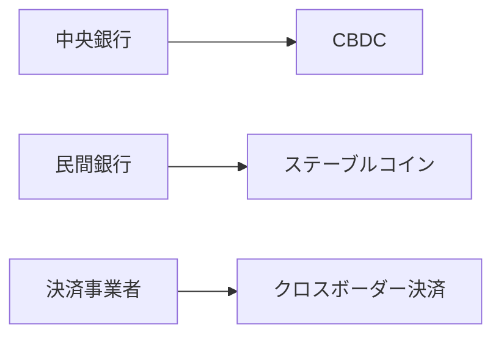

# ブロックチェーン技術の実用化事例調査

## 調査背景

ブロックチェーン技術は仮想通貨の基盤技術として注目を集めましたが、近年では様々な業界での実用化が進んでいます。本調査では、企業における具体的な実装事例と課題について分析します。

## 調査方法

- **期間**: 2024年1月-2月
- **対象**: 国内外の企業50社
- **方法**: 公開情報の分析、ケーススタディ

## 主要な実用化事例

### 1. 金融業界

#### デジタル通貨・決済


**具体例:**
- 日本銀行のデジタル円実証実験
- JPモルガンのJPMコイン
- リップル社の国際送金ソリューション

### 2. サプライチェーン管理

#### 食品業界での トレーサビリティ
- **ウォルマート**: 食品の産地から店舗までの追跡
- **ネスレ**: コーヒー豆のサプライチェーン透明化
- **カルフール**: 農産物の品質保証システム

#### 製造業での部品管理
- **BMW**: 自動車部品の偽装防止
- **デビアス**: ダイヤモンドの真贋判定
- **エバーレッジャー**: 高級品の認証システム

### 3. デジタルアイデンティティ

| 企業/組織 | 用途 | 特徴 |
|-----------|------|------|
| エストニア政府 | 電子市民権 | 国家レベルでのID管理 |
| Microsoft | Azure AD | 企業向けID認証 |
| IBM | Digital Credentials | 学歴・資格証明 |

## 導入における課題分析

### 技術的課題

1. **スケーラビリティ**
   - トランザクション処理速度の限界
   - ネットワーク負荷の増大

2. **相互運用性**
   - 異なるブロックチェーン間の連携
   - レガシーシステムとの統合

3. **エネルギー消費**
   - 特にPoW系ネットワークの環境負荷
   - 持続可能性への懸念

### 制度的課題

- **規制の不確実性**: 法的フレームワークの整備遅れ
- **標準化の不足**: 業界標準の策定が必要
- **人材不足**: ブロックチェーン専門家の確保

## 成功要因の分析

### 1. 明確な価値提案
✅ 既存システムに対する明確な優位性  
✅ ROIの定量化  
✅ ステークホルダーの合意形成  

### 2. 段階的導入アプローチ
```
フェーズ1: PoC (概念実証)
    ↓
フェーズ2: パイロット運用
    ↓  
フェーズ3: 本格展開
```

### 3. パートナーシップ戦略
- 技術パートナーとの連携
- 業界コンソーシアムへの参加
- 規制当局との対話

## 今後の展望

### 短期的（1-2年）
- **プライベートブロックチェーン**の普及
- **ハイブリッド構成**の増加
- **規制整備**の進展

### 中期的（3-5年）
- **相互運用性**の実現
- **量子耐性**の実装
- **Web3エコシステム**の成熟

### 長期的（5年以上）
- **デジタル社会インフラ**としての定着
- **新しいビジネスモデル**の創出
- **分散型インターネット**の実現

## 推奨事項

### 企業向け
1. **戦略的視点**での技術評価
2. **パイロットプロジェクト**からの開始
3. **人材育成**への投資

### 政策立案者向け
1. **規制サンドボックス**の活用
2. **国際協調**による標準化推進
3. **イノベーション促進**政策の検討

## まとめ

ブロックチェーン技術は概念実証段階から実用化段階へと移行しており、特定の用途において明確な価値を提供しています。しかし、広範な普及には技術的・制度的課題の解決が不可欠です。

企業は自社のビジネス課題と技術の特性を慎重に評価し、段階的なアプローチでの導入を検討することが重要です。

---

**調査チーム**: ブロックチェーン研究グループ  
**連絡先**: blockchain-research@example.com  
**最終更新**: 2024年2月10日